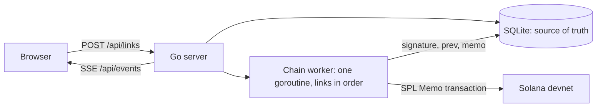

# Kindness Chain

One sentence from you. One dime from me. Verified on-chain.

**Live: https://kindness-chain.fly.dev**

Anyone can add one sentence about a kind thing they did or will do today. No signup, no wallet. Each sentence becomes a link: an SPL Memo transaction on Solana devnet whose JSON carries the signature of the link before it, so the whole chain can be walked and counted by anyone with a block explorer. For every confirmed link I donate $0.10 to the [International Institute of Minnesota](https://iimn.org), up to $50. The chain is the receipt.

The pledge itself is link #0, written on-chain before anything else: [3q5P…5W54](https://explorer.solana.com/tx/3q5P2tY6kc2Y7tSMUcb9q5WcDZmaZPhv73PDWK2a3mAWBLVYHgvUXHjaFZcTFi99sdiLyVYhxru2h43ErYri5W54?cluster=devnet). The chain starts there, with `prev` set to `genesis`. The signer account, [BhYB…ES7](https://explorer.solana.com/address/BhYBDXgFWFRCK8MTamXEuWpxhKgRWJj1i2QeZHrWES7?cluster=devnet), also carries one smoke-test memo from before link #0; everything from #0 on is the chain.

Built for the [DEV Weekend Challenge: Generosity Edition](https://dev.to/challenges/weekend-2026-09-03), September 4 to 7, 2026.

## How it works



A submission is validated, stored as `pending`, and handed to a single worker goroutine. The worker takes links strictly in order, reads the signature of the last confirmed link, builds the memo, sends one SPL Memo v2 transaction, waits until the cluster reports it confirmed, and only then records the signature. Because there is one worker, a memo's `prev` always points at a signature that is already on the chain. A memo looks like this, taken from link #2:

```json
{"v":1,"n":2,"act":"Ran the full deploy check on this chain from the command line, so every link after this one lands where it should.","by":"","prev":"394BGKjQGMSdwHFEVx8dC1fA6e1txYSHCGiFBeD2WEf5umr3YuczZxRVGJHRHChJCYNpQBmNah28bRPzB284KE7w","t":"2026-09-06T05:13:32Z"}
```

The field order is fixed and `t` is the time the visitor added the link, so the bytes can be rebuilt from the stored row and compared with what the cluster holds. That is what `GET /api/verify/{n}` does: it fetches the transaction, decodes the memo instruction, and compares it field by field with the database. The page's Verify button calls it and shows both sides.

SQLite is the source of truth and the index: it holds every link, its status, and the memo that was sent. Solana is the public proof. Nothing about a link is invented by the chain writer; the memo is the row. A memo has to fit one instruction, which is 566 bytes, and a 200 character sentence in a wide script can get close, so the size is checked when the sentence is submitted, not when the worker gets to it.

The worker retries a send that fails for network reasons with a growing delay and keeps the link pending; after three failures in a row the page shows the chain as paused. A transaction the cluster rejects for good marks the link failed and the worker moves on to the next one, chaining it to the last link that did land. A restart re-queues every pending link, so nothing is lost when the machine goes down.

Two honest limits. This runs on devnet, which is free and can be reset by Solana at any time; after a reset the explorer links to older transactions stop resolving, the database still has every link, and verify says the cluster no longer knows the transaction. And a single server-side key signs every memo, so visitors never touch a wallet. That means trusting me not to rewrite what people wrote, which is exactly why every memo is public and comparable with the stored row.

Link #0 is the pledge and does not count toward it. The counter and the pledged amount count confirmed links from #1 on.

## Anti-abuse

There are no accounts, so every layer has to work without knowing who is asking. None of them may add friction a person notices.

1. Sentence rules. 10 to 200 characters, an optional name up to 40, no `http://`, `https://` or `www.`, a short blocklist of words matched as whole words, control and invisible characters stripped, whitespace collapsed. Refused sentences never count against any limit.
2. A honeypot field. People never see it; a script that fills every field does, and gets a convincing 202 that writes nothing.
3. Proof of work in the browser. `GET /api/challenge` hands out a random seed. The page finds a nonce so that SHA-256 of `seed + nonce + sentence` starts with `POW_BITS` zero bits (18 by default) using the Web Crypto API, and sends both with the sentence. A laptop takes about half a second, a phone a second or two, and the page says "Sealing your link" while it works. The server checks the hash, spends the seed, and refuses reused, unknown or expired seeds; seeds live in memory for ten minutes.
4. Duplicate detection. A sentence is reduced to a fingerprint (lowercase, punctuation and symbols removed, single spaces) and refused with `This sentence is already in the chain` if the same fingerprint was added in the last 24 hours.
5. A per-address limit. Three links per hour per client address, in a sliding window kept in memory only. The address comes from Fly's own header, which a visitor cannot forge. Over the limit the answer is a 429 with `Retry-After` and the number of minutes to wait.
6. A global throttle. The chain accepts `GLOBAL_PER_MINUTE` links a minute (10 by default), chain-wide, and answers 429 with `Retry-After` beyond that.
7. A bounded queue. At most 1000 links can wait for the worker; beyond that the answer is 503.

None of this makes spam impossible. Without accounts it cannot be. A determined script with many addresses could still fill the chain with junk, paying the proof of work per link and getting ten links a minute at most. The pledge cap is the financial backstop: past 500 confirmed links the chain keeps growing and the donation stops at $50. What the layers buy is that junk arrives slowly, costs something, and is easy to see in a feed that shows every sentence to everyone.

What is not collected: no email, no cookies, no analytics. Addresses are held in memory for the hourly limit and never written to disk. The sentence, the optional name, the timestamps and the signatures are public by design, on the chain and through the API.

## API

| Method | Path | What it does |
|---|---|---|
| GET | `/api/stats` | count, pledged and cap in cents, charity, signer, chain head, paused flag |
| GET | `/api/links?before=N&limit=50` | a page of links, newest first, `hasMore` for the next page |
| GET | `/api/links/{n}` | one link |
| POST | `/api/links` | `{act, by, seed, nonce}`; answers 202 with the pending link |
| GET | `/api/challenge` | a proof-of-work seed, its difficulty and expiry |
| GET | `/api/verify/{n}` | the memo read back from the cluster next to the stored one, and whether they match |
| GET | `/api/events` | server-sent events: `stats` on connect and after every change, `link` when a link is confirmed or fails |
| GET | `/healthz` | `ok` |

Adding a link from the command line means solving the challenge first. This does it in Python:

```python
import hashlib, json, urllib.request
base, act = "https://kindness-chain.fly.dev", "I carried my neighbour's groceries up three floors."
ch = json.load(urllib.request.urlopen(base + "/api/challenge"))
nonce = 0
while int.from_bytes(hashlib.sha256((ch["seed"] + str(nonce) + act).encode()).digest(), "big") >> (256 - ch["difficulty"]):
    nonce += 1
body = json.dumps({"act": act, "by": "", "seed": ch["seed"], "nonce": str(nonce)}).encode()
print(urllib.request.urlopen(urllib.request.Request(base + "/api/links", body, {"Content-Type": "application/json"})).read())
```

## Run locally

You need Go 1.26 and Node 24 or newer.

```
cp .env.example .env    # then paste your devnet keypair into SOLANA_KEYPAIR
make build-web          # builds the frontend into web/dist, where the binary embeds it
make run                # serves everything on http://localhost:8080
```

For frontend work run `make dev` in a second terminal; Vite serves the app on http://localhost:5173 and proxies the API to the Go server. `make test` runs vet and the tests, `make image` builds the same container Fly builds. Set `FAKE_CHAIN=1` to confirm links in memory without touching Solana, and `POW_BITS=0` to post with plain curl.

To write to devnet you need a keypair with some devnet SOL:

```
sh -c "$(curl -sSfL https://release.anza.xyz/stable/install)"
solana-keygen new --no-bip39-passphrase -o ~/kindness-chain-devnet.json
solana airdrop 1 -k ~/kindness-chain-devnet.json -u devnet
export SOLANA_KEYPAIR="$(cat ~/kindness-chain-devnet.json)"
go run ./cmd/memotest
```

The public faucet rate-limits; https://faucet.solana.com works when the command line does not. `memotest` sends one memo, prints the explorer link, reads the memo back and checks it matches. A memo costs 0.000005 SOL, so 1 SOL is enough for a very long chain.

| Variable | Default | Meaning |
|---|---|---|
| `PORT` | `8080` | listen port |
| `DB_PATH` | `chain.db` | the SQLite file |
| `SOLANA_RPC_URL` | `https://api.devnet.solana.com` | JSON-RPC node |
| `SOLANA_KEYPAIR` | required unless `FAKE_CHAIN` is set | the JSON byte array from `solana-keygen` |
| `SOLANA_CLUSTER` | `devnet` | named in explorer links |
| `FAKE_CHAIN` | off | confirm links in memory instead of on Solana |
| `PLEDGE_PER_LINK_CENTS` | `10` | the donation per confirmed link |
| `PLEDGE_CAP_CENTS` | `5000` | where the donation stops |
| `CHARITY_NAME`, `CHARITY_URL`, `PLEDGER_NAME` | required | worded into link #0 |
| `RATE_LIMIT_PER_HOUR` | `3` | links per client address per hour |
| `GLOBAL_PER_MINUTE` | `10` | links the whole chain accepts per minute |
| `POW_BITS` | `18` | proof-of-work difficulty; `0` turns it off |

The pledge sentence is built from the configuration at the first start and written as link #0, so the numbers on the page, in the memo and in this README come from the same place.

## Deploy

One machine on Fly.io with one volume for the database. Two machines would mean two chains, so the deploy passes `--ha=false`.

```
fly launch --no-deploy
fly volumes create data --size 1 --region ord
fly secrets set SOLANA_KEYPAIR="$(cat ~/kindness-chain-devnet.json)" \
  SOLANA_RPC_URL=https://api.devnet.solana.com SOLANA_CLUSTER=devnet \
  PLEDGE_PER_LINK_CENTS=10 PLEDGE_CAP_CENTS=5000 \
  CHARITY_NAME="International Institute of Minnesota" CHARITY_URL=https://iimn.org PLEDGER_NAME=Nazar
fly deploy --ha=false
```

`fly.toml` keeps the machine running (`auto_stop_machines` off, one machine minimum) because the worker and the open event streams have to stay up, mounts the volume at `/data`, and gives the process 25 seconds to finish a memo in flight when it is stopped. The Dockerfile builds the frontend, embeds it into a static Go binary, and runs it as an unprivileged user.

## Dependencies and credits

Backend: Go 1.26 and its standard library, plus [modernc.org/sqlite](https://modernc.org/sqlite) v1.58.0 (pure Go, so the binary builds with CGO off) and [solana-go](https://github.com/gagliardetto/solana-go) v1.23.0 for the RPC client, transaction building and the SPL Memo instruction.

Frontend: [React](https://react.dev) 19, [Vite](https://vite.dev) 8, [TypeScript](https://typescriptlang.org) 7, [Tailwind CSS](https://tailwindcss.com) 4. Typefaces, self-hosted through [Fontsource](https://fontsource.org): [Alegreya](https://github.com/huertatipografica/Alegreya) by Juan Pablo del Peral and [IBM Plex](https://github.com/IBM/plex) Sans and Mono, all under the SIL Open Font License.

Hosting: [Fly.io](https://fly.io). Ledger: [Solana](https://solana.com) devnet and the [SPL Memo](https://spl.solana.com/memo) program.

## Post-deadline commits

The tag `v0.1.0-challenge` marks the state of the repository at the challenge deadline. Anything committed after it is listed here.

Nothing yet.

## License

MIT
